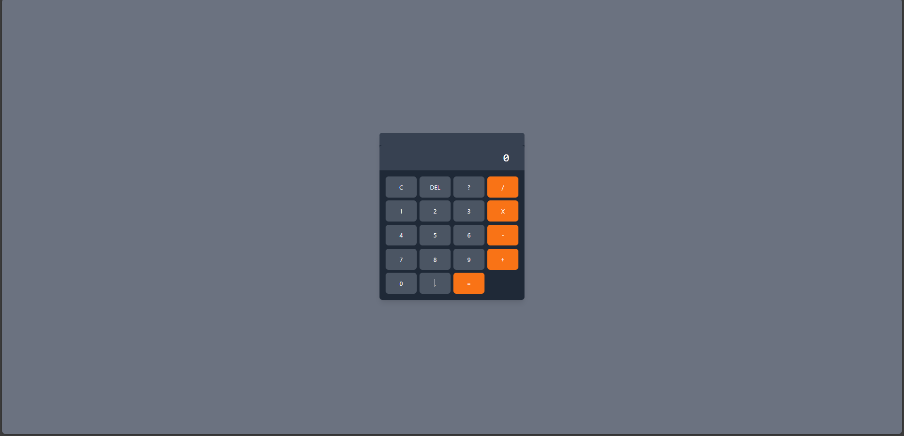
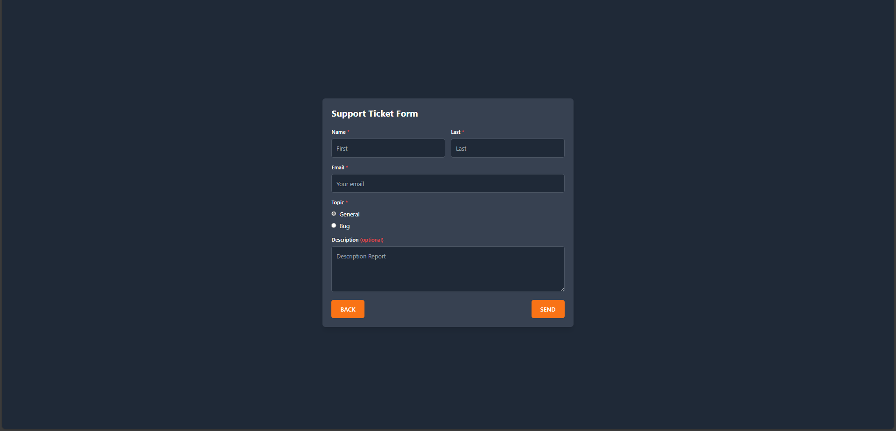

<h1>Calculator ReactTs 🧮</h1>
 
<p align="center">
  
</p>
 
<p align="center">Dashboard Page</p>

<p align="center">
  
</p>
 
<p align="center">Support Page</p>

## Installation For Window/RDP

```bash
npm i
npm start
```

## License

This project is under the [Yanzz](https://github.com/Yanzz231)

## Helper 🤖

Just DM me with instagram [Yanz](https://www.instagram.com/iyanmikasa/)